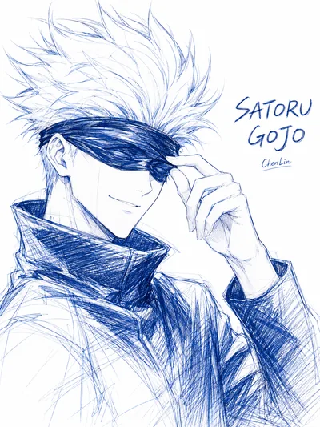

# Anime Lineart Director Gallery

`anime-lineart-director` 的官方作品画廊，以真实样图展示 Skill 对角色身份、人物动作、双人关系、线条密度、角色主色和特殊配色机制的处理能力。

> 本仓库只保存展示网站。Skill 源码位于 [Spark-chenlin/anime-lineart-director](https://github.com/Spark-chenlin/anime-lineart-director)。

<p align="center">
  
  
  
</p>

## 网站内容

- 39 张画廊作品，包括 23 张单人角色、9 张双人关系图和 7 张早期系列样图。
- 首页叠放轮播共 5 张参与轮转，同一时刻只有 3 张在台上，另外两张在台侧待命。
  名单在 `build_site.py` 的 `HERO_SLUGS`，改列表即可，点位和槽位会自动跟着生成。
- 每张作品都有可独立分享的详情页：左栏图片钉在视口不随滚动位移，右栏文字独立滚动，
  「上一张 / 下一张」常驻在图片下方，也支持键盘 ← →。
- 点击画廊里的任意作品会跳转到它的详情页，浏览位置由浏览器的前进后退自然管理。

## 本地预览

在仓库根目录运行：

```powershell
python -m http.server 18943 --bind 127.0.0.1
```

然后打开 <http://127.0.0.1:18943/>。

## 内容结构

```text
.
├─ index.html                 # 首页与画廊
├─ works/                     # 39 个独立作品页
├─ sitemap.xml, robots.txt    # 构建生成
├─ assets/
│  ├─ gallery/               # 正式样图的 WebP 原图（详情页用）
│  ├─ thumbs/                # 400w / 800w 网格缩略图（构建生成）
│  ├─ share/                 # 1200×630 社交分享卡片 JPEG（构建生成）
│  ├─ fonts/                 # 自托管 Noto Serif SC
│  ├─ data.js                # 构建生成的作品清单，供验证脚本使用
│  ├─ app.js                 # 首页轮播
│  └─ styles.css             # 主站样式
├─ content/
│  ├─ new_samples.json       # 作品标题与中文创作请求
│  ├─ original_prompts_zh.json
│  └─ legacy_samples.json
├─ build_site.py             # 重建画廊、缩略图、详情页、分享图、字体子集
└─ verify_site.cjs           # Playwright 整站验证
```

仓库不包含原始出图 PNG、测试截图或设计阶段原型，避免重复资源扩大仓库体积。

## 字体

大标题用的中文宋体是自托管的，不依赖访问者机器上装了什么字体。分两层：

1. `assets/fonts/noto-serif-sc-subset.woff2`（约 198KB）——站内实际用到的 472 个字，
   由 `build_site.py` 从完整字体裁出，是字体栈里的第一顺位。
2. `assets/fonts/noto-serif-sc/`（101 个 unicode-range 切片，共约 5.75MB）——完整字符集兜底。
   任何不在子集里的字会自动落到对应切片，只多下载一片，不会退化成后备字体。

也就是说**以后加新角色、改文案都不会漏字**，最多多一次切片请求；重新跑构建后子集会自动包含新字。

字体来自 Google Fonts 的 Noto Serif SC，[SIL Open Font License 1.1](assets/fonts/OFL.txt)。

## 重新生成页面

```powershell
python build_site.py
```

需要 `Pillow`。若还要重建字体子集，另需 `fonttools` + `brotli`，并把
[NotaSerifSC\[wght\].ttf](https://github.com/google/fonts/tree/main/ofl/notoserifsc)
放到 `assets/fonts/_src/`（该目录已 gitignore）。缺源文件时构建会跳过字体这一步并保留现有产物。

本地存在 `assets/generated/` 原始 PNG 时，脚本会优先从 PNG 重新生成优化后的 WebP 与缩略图。

## 部署

域名还没定。定下来后改 `build_site.py` 里的 `SITE_ORIGIN` 一行再跑一次构建，
`og:url` / `og:image` / `canonical` / `sitemap.xml` 会一起更新。

## 验证

先启动本地服务器，然后运行：

```powershell
node verify_site.cjs
```

跑在真实 Edge 上（headless shell 的滚动行为和真实浏览器不一致，会掩盖问题）。
33 项断言覆盖：首屏传输预算、自托管字体是否生效、网格行对齐、轮播切换与暂停、
键盘激活是否作用在聚焦元素上、点击作品是否跳转详情页、返回是否恢复滚动位置、
章节计数与实际数量是否一致、og/canonical 是否为绝对 URL、移动端触控目标尺寸、
详情页图片滚动时是否位移、上下张导航是否始终可见、
轮播张数与点位是否同步、同一时刻是否只展示 3 张、转一圈能否回到起点、
39 个详情页的破图/溢出/报错/4xx。结果写入 `verification.json`。

断言的是行为和几何，不是元素存不存在——上一版只检查存在性，漏掉过弹窗打开后跑到视口外的问题。

## 说明

画廊中的知名动漫角色用于非官方的风格与能力展示，相关角色权利归原权利方所有。网站代码采用 [MIT License](LICENSE)。
